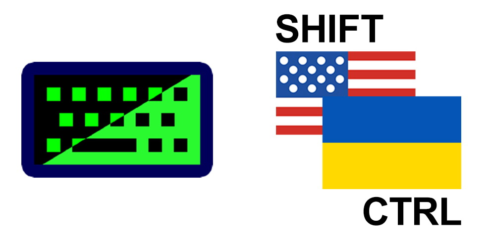
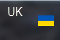
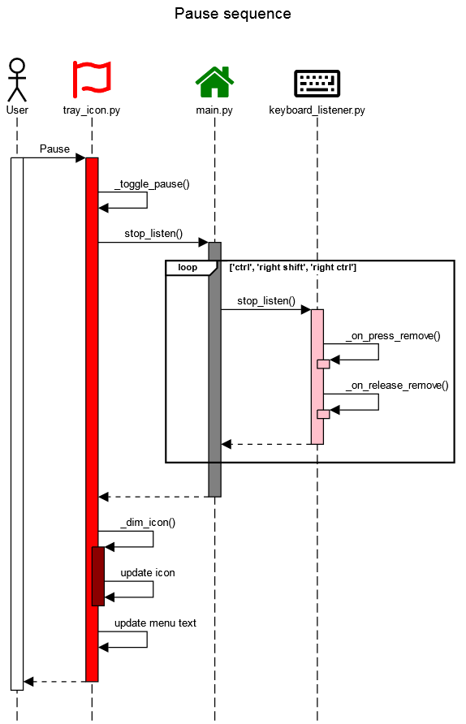

# One key switch keyboard layout for Windows

This simple program was developed to implement keyboard layout switching using just one key.

It utilizes the win32api, thus it will only work on Windows systems.



_Title image credits:_

> https://iconduck.com/icons/12138/keyboard
> 
> https://emojipedia.org/openmoji/15.0/flag-united-states
> 
> https://creativecommons.org/licenses/by-sa/4.0/

## How it works

The program provides a convenient way to switch between keyboard layouts using a single key. Instead of the usual method of using a key combination (like `Alt + Shift`), this program allows users to assign the `right CTRL` and `right SHIFT` keys to specific layouts, and the `left CTRL` key for a round-robin switching method.


* [docs/diagrams/start_sequence.txt](docs/diagrams/start_sequence.txt)

1. Start program from the script [main.py](main.py).
2. Read configuration settings from the [config.ini](config.ini) by [config_reader.py](config_reader.py):
   * **right shift** - Language ID to be selected by the right SHIFT key press.
   * **right ctrl** - Language ID to be selected by the right CTRL key press.
   * **layout check interval** - The time interval, in seconds (integer or float value), for checking layout changes.
   * **key press timeout** - If a hotkey is pressed for a duration in seconds (integer or float value) longer than this value, the layout change will not occur.
3. Attach listeners ([keyboard_listener.py](keyboard_listener.py)) on keys:
   * (left) CTRL
   * right CTRL
   * right SHIFT
4. Start keyboard monitor ([keyboard_layout_monitor.py](keyboard_layout_monitor.py)):
   * Start the tray icon ([tray_icon.py](tray_icon.py)) with the current layout flag ([flags/\*.png](flags)).

## Layout monitoring


* [docs/diagrams/keyboard_monitor_sequence.txt](docs/diagrams/keyboard_monitor_sequence.txt)

While the program is running it displays current keyboard layout as a flag:



The tray icon feature was implemented using the `pystray` library in the script [tray_icon.py](tray_icon.py).

Flag icons should be placed in the [flags](flags) directory. Files should be in PNG format and named after the countries they represent in English. If the program cannot find the appropriate image file, an error message will be written to the `error.log` file:

```
2024-04-12 20:48:33 [ERROR] tray_icon: Flag not found: [Errno 2] No such file or directory: 'flags/France.png'
```

Keyboard layout is linked to each window so that when you switch between different windows, the keyboard layout will also change according to the last set layout for that window. I didn't find a way to hook into the 'keyboard layout change' event using win32api, so I implemented regular monitoring of the current layout. If there is no flag icon corresponding to the country of the current layout, an autogenerated pattern is displayed:


This pattern of `red and yellow squares` for the unknown country is defined in the [tray_icon.py](tray_icon.py) constant `UNDEFINED_FLAG`.

The periodicity of checking the keyboard layout can be set by the `layout check interval` in the [config.ini](config.ini). If it is not set, then the default value from the constant `CHECK_INTERVAL` in [keyboard_layout_monitor.py](keyboard_layout_monitor.py) is used.

The check process is running in the daemon thread, so it doesn't interfere with other program logic execution. As a daemon thread, it will be automatically killed when the program exits, but the `stop` method is implemented as well.

## Hotkeys


* [docs/diagrams/hotkey_sequence.txt](docs/diagrams/hotkey_sequence.txt)


* [docs/diagrams/hotkey_cancel_sequence.txt](docs/diagrams/hotkey_cancel_sequence.txt)

When the user presses down any key, the `_on_key_press` method of all listeners is triggered (see [keyboard_listener.py](keyboard_listener.py)). The listener attached to that key stores the time of event, while all other listeners reset this value. This filters out the event where the user presses another key while holding a hotkey, for example, pressing the `C` key while holding down `CTRL`, so the hotkey event will be skipped during this time.

When the user releases the key, the method `_on_key_release` of the specific listener is called. If the user holds the key for too long, nothing happens; otherwise, a new keyboard layout will be set.

* `right SHIFT` -> 
* `right CTRL` -> 
* `left CTRL` -> 
 ->
 ->
 ->


## Change keyboard layout

The feature to change the keyboard layout is implemented using win32api in the script [keyboard_layout_controller.py](keyboard_layout_controller.py).

To change the keyboard layout, we need to retrieve the current foreground window and send a specific message to it requesting a layout change. The window may either accept or reject this request. For instance, the "Task Manager" rejects layout changes, and it may not be possible to fix this behavior. It's important to check if the window has a parent, as child windows reject keyboard language changes due to their dependency on the parent window's layout settings. Therefore, if our window has a parent, we need to address the request to its parent window.

Keyboard layout ID is a 32-bit integer value and consists of two parts:
1. layout ID
2. country ID (language ID)

To request a change in keyboard layout, we can use either the full layout ID or just the language ID part.

Some examples of different layout IDs:
* QWERTY-layout for US-English lang (`EN`): `0x4090409`
* QWERTZ-layout for German lang (`DE`): `0x4070407`
* ЙЦУКЕН-layout for Ukrainian lang (`UK`): `-0xf57fbde`

Last 16 bits of a full layout ID represent the country or the language:
* `0x409` - `EN`, English (United States)
* `0x407` - `DE`, German (Germany)
* `0x422` - `UK`, Ukrainian (Ukraine)

How do I get `0x422` from `-0xf57fbde`, you may wonder. Let's represent this value in the proper negative 32-bit format:
```
-0xF57FBDE = 0xF0A80422

- 0000 1111 ' 0101 0111 ' 1111 1011 ' 1101 1110
  =
  1111 0000 ' 1010 1000 ' 0000 0100 ' 0010 0010
```

You can find all supported languages along with their IDs and country names here:

* [https://learn.microsoft.com/en-us/openspecs/windows_protocols/ms-lcid/a9eac961-e77d-41a6-90a5-ce1a8b0cdb9c](learn.microsoft.com)

## Pause and continue listening the hotkeys

1. Right-click on the tray icon
2. You will see the popup-menu
3. Click on the "Pause"


4. Icon will become darker


5. Hotkeys are canceled and will not change the keyboard layout

Despite this, the flags icon will still be changed according to the current layout; only the attachment of hotkeys is canceled.



* [docs/diagrams/pause_sequence.txt](docs/diagrams/pause_sequence.txt)

To unpause - click "Continue":


* [docs/diagrams/continue_sequence.txt](docs/diagrams/continue_sequence.txt)

## Exit from the program

1. Right click on the tray icon
2. You will see the popup-menu
3. Click on the "Exit"


* [docs/diagrams/stop_sequence.txt](docs/diagrams/stop_sequence.txt)

# Build process

This program may be built into an exe-file using `pyinstaller`:
```
pip install pyinstaller

pyinstaller --noconsole main.py
```

But for proper building and copying of important resources, there is a special build script - [build.py](build.py), which:

1. Removes previous files of the previous distribution build.
2. Prepares the icon if set:
   * Copies specified icon and saves it in the proper format (see [icon_generator.py](icon_generator.py).copy_icon()).
   * Generates an icon with two partially overlapped flags (see [icon_generator.py](icon_generator.py).generate_icon())
3. Runs `pyinstaller` to create an executable file with the specifications provided in [main.spec](main.spec).
4. Copies resources specified in the `RESOURCES` constant, such as images from [flags/*.png](flags/) and the [config.ini](config.ini) file.
5. Creates an archive for distribution.

# Sources

## Python scripts

* [main.py](main.py) - The starting script sets up logging, requests configuration reading, sets up and runs hotkey listeners, and finally, runs the tray icon.
* [config_reader.py](config_reader.py) - Represents `Config` class. Reads configuration settings from the [config.ini](config.ini) file and stores the collected data in the fields of the `Config` class.
* [keyboard_listener.py](keyboard_listener.py) - Represents `KeyboardListener` class, which attaches listen methods to key events.
* [keyboard_layout_monitor.py](keyboard_layout_monitor.py) - Represents `KeyboardLayoutMonitor` class, which periodically checks current keyboard layout and updates the tray icon.
* [keyboard_layout_controller.py](keyboard_layout_controller.py) - Contains functions to retrieve or modify data necessary for working with the keyboard layout via win32api.
* [tray_icon.py](tray_icon.py) - Represents `TrayIcon` class, which is used to load, display and update icon in the tray using the `pystray` library.

## Resources

* [config.ini](config.ini) - Contains configuration settings.
* [flags/\*.png](flags) - Contains images of flags representing different countries, which are displayed in the tray as icon linked to the current keyboard layout language.
* [icons/\*.\*](icons) - Just various icons for the built executable file.

## Documentation
* [docs/diagrams/](docs/diagrams) - Diagrams
* [docs/img/](docs/img) - Addidional images

## Build files

* [build.py](build.py) - The main build script, which runs the process to build the executable file, copies resources, and creates a distribution zip archive.
* [icon.gif](icon.gif) - Icon is used for the exe.
* [icon_generator.py](icon_generator.py) - Generator icon for the exe with two partial overlapped flags.
* [main.spec](main.spec) - `pyintaller` build specification.
* [version_info.txt](version_info.txt) - Windows version file, which adds extra information to the exe-file.

# Compatibility

This program is designed to work on Windows systems only due to its dependency on win32api.

# Possible issues (language doesn't switch)

* When you run the program for the first time, select any window and then try using the hotkey.
* The program cannot change the keyboard language for the "Task Manager" as it rejects the request.
* Clicking on certain icons in the tray may cause the hotkey to stop working -> just select some window.
* You hold a hotkey for too long -> you may increase timeout value in the [config.ini](config.ini) - `key press timeout`.
* If you press another key while holding a hotkey - this is a normal behavior, just to prevent unintentional layout changes.

# Author

- [@asilichenko](https://github.com/asilichenko)

# License

[GNU License LGPL v3.0](LICENSE)

# Credits

* Image [icons/keyboard.svg](icons/keyboard.svg) - is under [CC BY 4.0](https://creativecommons.org/licenses/by-sa/4.0/) license, source [https://iconduck.com/icons/12138/keyboard](https://iconduck.com/icons/12138/keyboard)
* Image [flags/United States.png](flags/United%20States.png) - is under [CC BY 4.0](https://creativecommons.org/licenses/by-sa/4.0/) license, source [https://emojipedia.org/openmoji/15.0/flag-united-states](https://emojipedia.org/openmoji/15.0/flag-united-states)
* Sequence diagrams were created using the web-editor: https://sequencediagram.org/

# Disclaimer

This program is provided as-is, without any warranty. Use it at your own risk.

Sometimes, antivirus software may mistakenly flag this program as a Trojan "Win64:Evo-Gen". However, I assure you that it's a false positive alarm. This occasionally happens with Python programs that have been compiled using PyInstaller.
